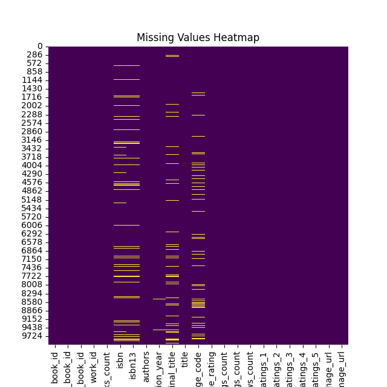
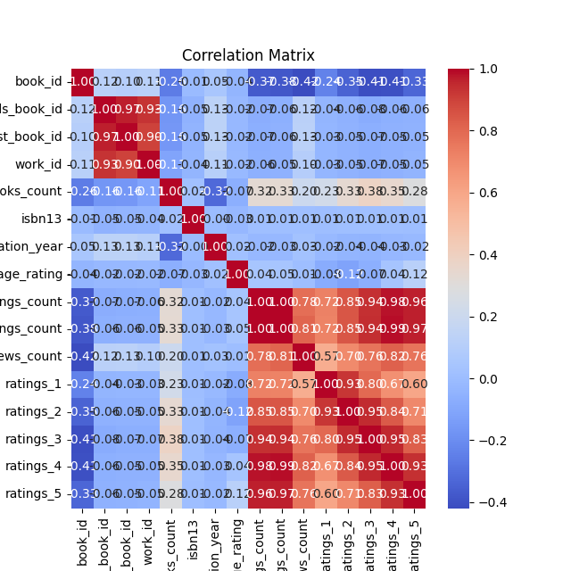

# Dataset Analysis Report

## Dataset Overview
The dataset contains 10000 rows and 23 columns.

### Columns
- **book_id**: int64
- **goodreads_book_id**: int64
- **best_book_id**: int64
- **work_id**: int64
- **books_count**: int64
- **isbn**: object
- **isbn13**: float64
- **authors**: object
- **original_publication_year**: float64
- **original_title**: object
- **title**: object
- **language_code**: object
- **average_rating**: float64
- **ratings_count**: int64
- **work_ratings_count**: int64
- **work_text_reviews_count**: int64
- **ratings_1**: int64
- **ratings_2**: int64
- **ratings_3**: int64
- **ratings_4**: int64
- **ratings_5**: int64
- **image_url**: object
- **small_image_url**: object

## Insights from Analysis
### Story of the Book Rating Dataset

#### 1. Data Received
The dataset encompasses 10,000 rows and 23 columns, capturing the intricate details of various books. Each entry represents a distinct book with identifiers such as `book_id`, `goodreads_book_id`, `best_book_id`, and `work_id`. It also includes textual fields such as `authors`, `original_title`, and `title`. Notably, it features attributes related to the book's publication—`original_publication_year`, the `isbn`, `isbn13`, and the `language_code`. The dataset provides valuable insights into reader perceptions through columns such as `average_rating`, `ratings_count`, and the individual counts of ratings from 1 to 5. With a total of 2,975 missing values, the dataset is relatively clean, but further attention is warranted to these gaps.

#### 2. Analyses Carried Out
Basic statistical analyses were conducted on the numerical columns, revealing a wide range of statistics such as mean, median, standard deviation, and percentiles. For instance, the `average_rating` of books hovers around 4.00, indicating a generally positive reception. The `ratings_count` averages about 54,000, indicative of significant engagement with the books. Analysis of `original_publication_year` shows that the majority of books were published post-2000, while the oldest publication dates back to 1750—a period that indicates the dataset encompasses both contemporary and classic literature. 

After scrutinizing the missing values, it was essential to identify patterns, such as whether they are concentrated in specific columns or random across the dataset. 

#### 3. Insights Discovered
Key insights emerged from the analysis:
- A correlation was evident between the number of ratings (`ratings_count`) and the `average_rating`, suggesting that books with more ratings tended to have higher scores. This may indicate that popular books (those people are more likely to read and rate) receive higher average ratings.
- The spread of `average_rating` suggests there are numerous standout titles with ratings near 5, while some books struggle to reach even a 3.
- The dataset shows trends regarding publication years; books published in the last two decades seem to have more ratings and higher average ratings than older books, perhaps due to better marketing strategies and wider accessibility.

#### 4. Implications of these Findings
The insights gleaned have several implications:
- **Marketing Strategies**: Publishers and authors can focus their marketing efforts on books trending positively in ratings and those with higher engagement levels to replicate their success.
- **Publication Trends**: Understanding that newer publications generally receive more ratings can help in decision-making around what types of books to invest in or promote.
- **Reader Preferences**: An in-depth exploration of the genres or themes of higher-rated books can lend insight into consumer preferences, informing future writing or curation efforts.

#### Further Analysis Suggestions
To deepen the understanding of the dataset, several avenues for further analysis could be pursued:
- **Sentiment Analysis of Reviews**: Exploring the text reviews and correlating them with average ratings may provide qualitative insights into what readers value in books.
- **Genre Analysis**: Grouping books by genre or author to determine trends in ratings and engagement could uncover specific niches or demographics that respond well to particular types of literature.
- **Comparative Analysis by Language**: Evaluating how books in different languages perform might reveal cultural preferences and help international publishers tailor their strategies accordingly.
- **Time Series Analysis**: Analyzing the trend of `average_rating` and `ratings_count` over time could illustrate how reader responses evolve, particularly in response to contemporary social issues or popular media adaptations.

Through a multifaceted approach to these analyses, richer insights can be uncovered, ultimately enhancing the understanding of reader behaviors and preferences in the ever-evolving landscape of literature.

## Visualizations

