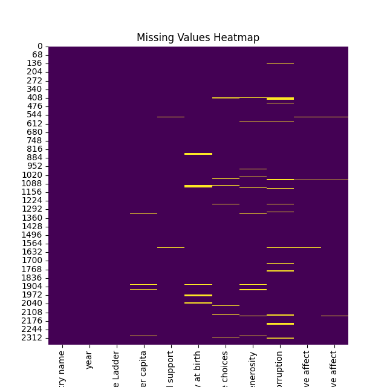
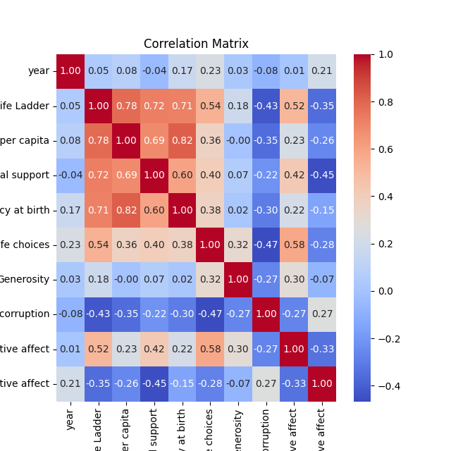

# Dataset Analysis Report

## Dataset Overview
The dataset contains 2363 rows and 11 columns.

### Columns
- **Country name**: object
- **year**: int64
- **Life Ladder**: float64
- **Log GDP per capita**: float64
- **Social support**: float64
- **Healthy life expectancy at birth**: float64
- **Freedom to make life choices**: float64
- **Generosity**: float64
- **Perceptions of corruption**: float64
- **Positive affect**: float64
- **Negative affect**: float64

## Insights from Analysis
### Narrative on the Dataset

#### 1. The Data Received
The dataset comprises 2,363 entries, each representing a unique observation aligned with various nations over a span of years. Containing 11 columns, this dataset provides a detailed look into factors influencing the perception of well-being across different countries. The columns include indicators such as Life Ladder, Log GDP per capita, Social support, Healthy life expectancy at birth, Freedom to make life choices, Generosity, Perceptions of corruption, and emotional well-being measures (Positive affect and Negative affect).

Notably, this dataset has a total of 386 missing values across its columns, suggesting either incomplete data collection or entry issues that could affect certain analyses.

#### 2. The Analyses Carried Out
The basic statistical analysis for the numerical columns was executed, yielding insights into the central tendencies (mean, median), dispersions (standard deviations, quartiles), and ranges (minimum, maximum) of each indicator. 

- **Descriptive statistics** highlighted overall trends, such as the average Life Ladder score being approximately 5.48, indicating a moderate level of subjective well-being among respondents.
- The analysis showed a healthy average life expectancy of about 63.4 years, which is further encouraged by robust social support scores averaging around 0.81.
- The correlation between Log GDP per capita and Life Ladder suggests a positive relationship, which highlights how economic stability might translate to improved societal well-being.

#### 3. The Insights Discovered
From the statistical measures, several key insights emerged:
- There is considerable variability in the Life Ladder scores, as evidenced by the standard deviation of 1.13. This indicates disparities in perceived quality of life across different countries.
- The data signifies a potential link between economic and social factors: countries with higher Log GDP per capita and enhanced social support tend to achieve higher scores in Life Ladder.
- The perceptions of corruption exhibit a negative skew, as countries with perceived higher corruption tend to report lower scores in life satisfaction.

These insights suggest that socioeconomic factors and governance quality fundamentally influence public perceptions of life satisfaction.

#### 4. Implications of These Findings
The findings have several implications:
- Policymakers could prioritize improving economic conditions and social safety nets to raise Life Ladder scores, focusing particularly on initiatives that enhance social support systems within communities.
- Addressing corruption head-on could be crucial for both improving happiness metrics and fostering a stable environment conducive to economic growth.
- Countries that lag in certain areas, such as health and economic performance, should consider tailored interventions targeting those specific domains to enhance overall national well-being.

#### Further Analysis Suggestions
To gain deeper insights, additional analyses could include:
- **Correlation Analysis**: A more exhaustive correlation analysis between all variables could unveil more intricate relationships, particularly between emotional wellbeing metrics (Positive vs. Negative affect) and socio-economic indicators.
- **Time Series Analysis**: Evaluating changes over the years for individual countries could elucidate patterns and trends related to well-being as a function of economic performance and social development.
- **Cluster Analysis**: Segmenting countries into clusters based on similar characteristics (e.g., economic performance, life satisfaction) might assist in formulating region-specific policies.
- **Machine Learning Models**: Implementing predictive models could forecast life satisfaction based on variables like GDP growth and social support, informing proactive measures that policymakers can take.

This comprehensive exploration of the dataset will contribute to a better understanding of the dynamics involving happiness and well-being across different global contexts and help shape future strategies aiming to improve quality of life.

## Visualizations

