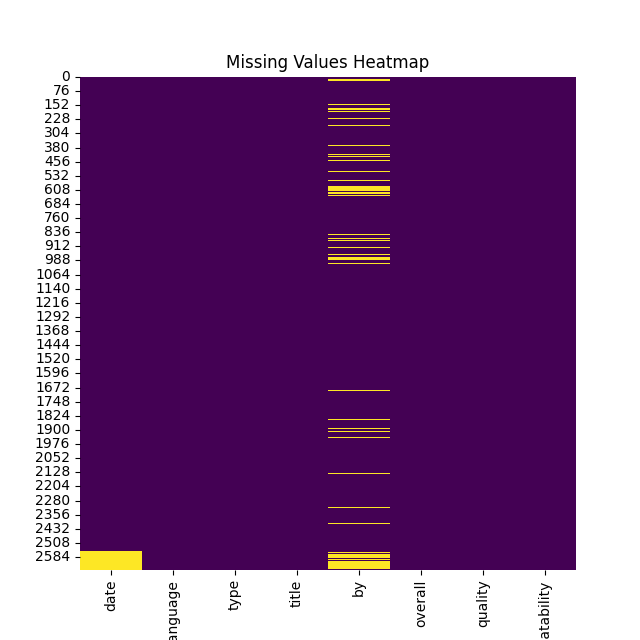
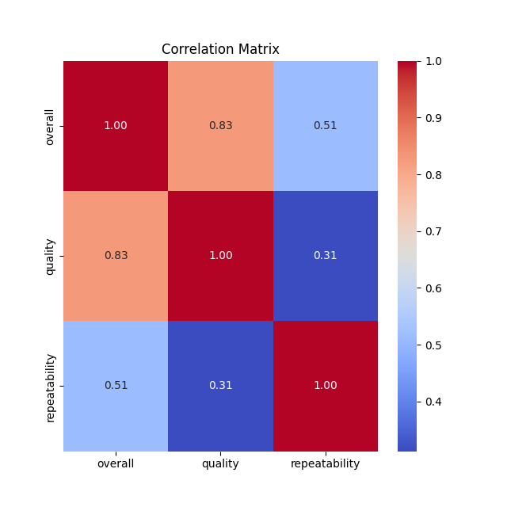

# Dataset Analysis Report

## Dataset Overview
The dataset contains 2652 rows and 8 columns.

### Columns
- **date**: object
- **language**: object
- **type**: object
- **title**: object
- **by**: object
- **overall**: int64
- **quality**: int64
- **repeatability**: int64

## Insights from Analysis
### Story of the Dataset

#### 1. The Data Received
The dataset consists of 2,652 entries, each representing a distinct record related to some quality assessment. It contains eight columns, where the date, language, type, title, and by fields provide context and categorization, while the numerical columns (overall, quality, and repeatability) represent standardized assessments of these records. Overall, quality, and repeatability appear to be scores assigned based on certain criteria, with values ranging from 1 to 5, 1 to 5, and 1 to 3, respectively. Notably, there are 361 missing values spread through the dataset, indicating that some fields may require attention for completeness.

#### 2. The Analyses Carried Out
Basic statistical analyses of the numerical columns were performed, yielding the following insights:

- **Count**: Each of the three numerical columns has the same number of entries (2,652), with numerical values ranging from 1 to 5 for overall and quality, and from 1 to 3 for repeatability.
  
- **Descriptive Statistics**: The mean scores indicate that:
  - The overall score averages at around 3.05, suggesting moderate to good appraisal across entries.
  - The average quality score is slightly higher at 3.21, pointing toward a general trend of acceptable quality.
  - Repeatability, on the other hand, has a lower average of approximately 1.49, highlighting that most assessments have lower scores in this criterion.
  
- **Variability**: The standard deviations hint at a reasonable spread in the scores. For instance, the overall score has a relatively higher standard deviation (0.76), which suggests variability beyond the mean assessment.

#### 3. The Insights Discovered
The analysis indicates several trends within the dataset:
- The majority of entries reflect overall assessments tending towards acceptable values (around 3), suggesting that the items represented are generally of decent quality.
- However, the lower mean repeatability score indicates potential concerns regarding the consistency or reliability of the assessments, warranting further investigation.

- The presence of missing values could skew interpretations or analyses, emphasizing the need for cleaning or imputation before diving deeper.

#### 4. Implications of These Findings
The findings raise important questions and actions to consider:
- **Quality Assurance**: Given the relatively low repeatability score, it may be essential to evaluate the criteria used for these assessments. Organizations or individuals may need to implement more standardized procedures or training for evaluators to enhance consistency.
  
- **Analysis of Missing Values**: Addressing the missing values should become a priority, as they may hold significant insights into patterns within the dataset. Techniques such as imputation or data cleaning should be considered to recover the completeness of the records where feasible.

#### Suggested Further Analysis
To gain deeper insights, the following analyses could be performed:
- **Correlation Analysis**: Investigate the relationships between overall, quality, and repeatability scores—do higher quality assessments correlate with higher overall scores or better repeatability?
  
- **Trend Analysis**: If data points cover a range of dates, a temporal analysis could elucidate trends over time, such as improvements or declines in overall assessments or quality.
  
- **Cause of Missing Values**: Assess the patterns behind missing values to understand if certain types, languages, or other attributes are more susceptible to data loss.
  
- **Segment Analysis**: Break down records by language, type, or authorship (the "by" field) to identify if certain groups consistently show better or worse scores, which could inform targeted improvement actions.

By undertaking these further analyses, more nuanced insights can be obtained, ultimately driving improvements in the processes or items evaluated within the dataset.

## Visualizations

